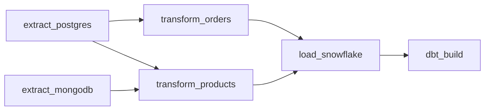

# Airflow & Orchestration

Apache Airflow is used to orchestrate the entire ELT (Extract, Load, Transform) pipeline. It runs inside Docker containers (scheduler, webserver) and mounts the project directory to access the ETL scripts, dbt project, and local data lake folders.

## The `ecommerce_etl_pipeline` DAG

The main DAG is defined in `dags/ecommerce_etl_pipeline.py`. It runs on a daily schedule (`0 2 * * *` - 02:00 UTC).

### DAG Dependency Graph

### Task Descriptions

1. **`extract_postgres` (PythonOperator)**
   - Connects to the local PostgreSQL database using SQLAlchemy.
   - Extracts tables (`customers`, `orders`, `order_items`, `products`, `reviews`) into Parquet files in the Bronze layer (`data/bronze/postgres/`).

2. **`extract_mongodb` (PythonOperator)**
   - Connects to the local MongoDB instance using PyMongo.
   - Extracts collections (`campaign`, `ad_spend`, `clicks`) into JSON files in the Bronze layer (`data/bronze/mongodb/`).

3. **`transform_orders` (PythonOperator)**
   - Reads Bronze order and order_item Parquet files.
   - Uses **Pandas** to clean data, parse timestamps, and handle duplicates.
   - Writes to the Silver layer (`data/silver/postgres/`).

4. **`transform_products` (PythonOperator)**
   - Reads remaining Postgres Bronze files and all MongoDB Bronze JSON files.
   - Applies Pandas transformations (type casting, data cleansing, calculating CTR).
   - Writes to the Silver layer (`data/silver/`).

5. **`load_snowflake` (PythonOperator)**
   - Uses the `snowflake-connector-python` and `write_pandas` to bulk-load all Silver Parquet files into the Snowflake `RAW` schema. It auto-creates tables and overwrites existing data.

6. **`dbt_build` (BashOperator)**
   - Executes `dbt build` inside the mounted `ecommerce_dbt` directory.
   - Passes Snowflake credentials from Airflow variables/environment into the Bash environment for dbt's `profiles.yml` to consume.
   - Runs models and tests sequentially to produce the final `MARTS` schema.

## Volumes & Permissions

To allow Airflow to interact seamlessly with the host file system, the `docker-compose.yml` mounts several directories:
- `./dags` -> `/opt/airflow/dags`
- `./data` -> `/opt/airflow/data` (The local data lake)
- `./ecommerce_dbt` -> `/opt/airflow/ecommerce_dbt`

Permissions for the `dags/` folder are automatically adjusted during the `airflow-init` phase (`chmod -R g+w /opt/airflow/dags`) to ensure the host user can write files directly to the DAG directory without relying on `docker cp`.
