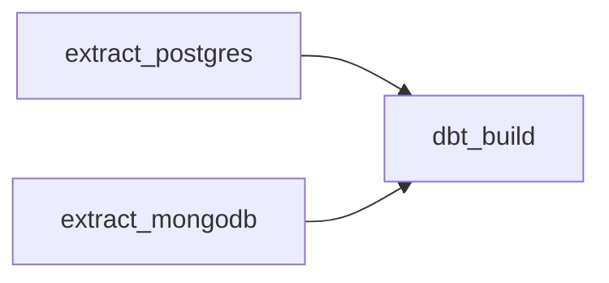

# Airflow & Orchestration

Apache Airflow orchestrates the entire **ELT** (Extract, Load, Transform) pipeline. It runs inside Docker containers (scheduler, webserver) and mounts the project directory to access the dbt project.

## The `ecommerce_elt_pipeline` DAG

The main DAG is defined in `dags/ecommerce_elt_pipeline.py`. It runs on a daily schedule (`0 2 * * *` — 02:00 UTC).

### DAG Dependency Graph

```mermaid
graph LR
    EP[extract_postgres] --> DBT[dbt_build]
    EM[extract_mongodb]  --> DBT
```

### Task Descriptions

1. **`extract_postgres` (PythonOperator)**
   - Connects to the PostgreSQL database using SQLAlchemy.
   - Reads tables (`customers`, `orders`, `order_items`, `products`, `reviews`).
   - Loads each table **directly** into the Snowflake `RAW` schema using `write_pandas`.
   - No local file system writes — data flows in-memory from PostgreSQL → Snowflake.

2. **`extract_mongodb` (PythonOperator)**
   - Connects to MongoDB using PyMongo.
   - Reads collections (`campaign`, `ad_spend`, `clicks`).
   - Strips MongoDB `_id` ObjectIDs to prevent serialisation issues.
   - Loads each collection **directly** into the Snowflake `RAW` schema using `write_pandas`.

3. **`dbt_build` (BashOperator)**
   - Runs after **both** extract tasks complete successfully.
   - Executes `dbt build` inside the mounted `ecommerce_dbt` directory.
   - Passes Snowflake credentials from Airflow variables/environment into the Bash environment for dbt's `profiles.yml` to consume.
   - Transforms `RAW` tables through `STAGING` → `INTERMEDIATE` → `MARTS`.

### ELT Design Decision

> The previous architecture used an ETL pattern with local Bronze/Silver layers
> (Parquet files written to disk, then transformed with Pandas before loading).
> The current ELT design eliminates this intermediate step: raw data is loaded
> into Snowflake as-is, and **all transformations are performed inside the warehouse
> by dbt**. This keeps transformation logic warehouse-native, version-controlled,
> and testable.

## Volumes & Permissions

To allow Airflow to interact with the dbt project, `docker-compose.yml` mounts:

- `./dags` → `/opt/airflow/dags`
- `./ecommerce_dbt` → `/opt/airflow/ecommerce_dbt`

Permissions for the `dags/` folder are automatically adjusted during the `airflow-init` phase (`chmod -R g+w /opt/airflow/dags`) to ensure the host user can write files directly to the DAG directory without relying on `docker cp`.
