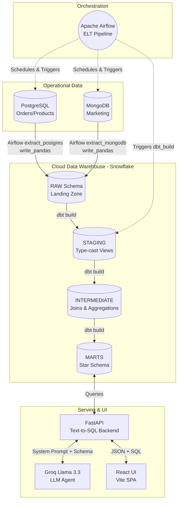

# System Architecture

The AI-Powered E-Commerce Data Platform is composed of multiple interconnected layers, bridging raw operational data to an intelligent, natural-language query interface.

## High-Level Data Flow

## Component Breakdown

1. **Sources**:
   - **PostgreSQL**: Simulates an operational e-commerce database (Customers, Orders, Items, Products, Reviews).
   - **MongoDB**: Simulates a NoSQL marketing datastore (Campaigns, Ad Spend, Clicks).

2. **ELT Pipeline (Airflow)**:
   - Data is extracted from source systems and loaded **directly** into the Snowflake `RAW` schema using `write_pandas`.
   - There is **no local data lake** (no Bronze/Silver layers on disk). The warehouse IS the landing zone.
   - All transformation logic lives inside dbt SQL models — not in Python scripts.

3. **Cloud Data Warehouse (Snowflake)**:
   - **RAW**: The landing zone for raw extracted data. Tables mirror source systems exactly.
   - **STAGING**: dbt views that apply type casting, null handling, and deduplication to RAW tables.
   - **INTERMEDIATE**: dbt views that join staging models and compute aggregations.
   - **MARTS**: dbt tables implementing a Kimball-style Star Schema (`fact_sales`, `dim_customer`, etc.).

4. **Intelligent Serving Layer**:
   - **FastAPI**: Hosts the agentic logic.
   - **Text-to-SQL Agent**: Uses Groq (Llama 3.3 70B) to translate natural language into SQL.
   - **SQL Validator**: Uses `sqlglot` to parse the generated SQL, enforce security constraints (read-only, target `MARTS` schema only), and inject execution limits.

5. **Frontend**:
   - A modern React application with a glassmorphism design that interacts with the FastAPI backend, displaying generated SQL and formatted result tables.
