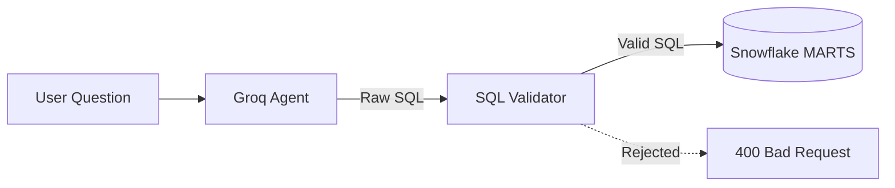

# Text-to-SQL Agent

The intelligent core of the platform is a Groq-powered Agent that translates natural language queries into executable Snowflake SQL.

## Architecture



## The LLM Agent (`agents/text_to_sql.py`)

- **Primary Model**: `llama-3.3-70b-versatile` (Fast, high reasoning capacity).
- **Fallback Model**: `llama-3.1-8b-instant` (Used if the primary model hits rate limits or fails).
- **Context Injection**: The system prompt injects the DDL schemas for all tables in the `MARTS` schema to ensure the model understands the data structure, relationships, and correct table names.

## The Validation Layer (`agents/sql_validator.py`)

To ensure absolute security and prevent accidental or malicious queries from executing against the Snowflake warehouse, all generated SQL is passed through a strict validation layer using the `sqlglot` library.

**Validation Rules:**
1. **SELECT Only**: The AST is parsed to ensure the root node is a `Select` expression. Any DML/DDL (Insert, Update, Delete, Drop, Alter) is instantly rejected.
2. **Schema Restrictions**: The query may only access tables explicitly whitelisted (i.e., tables existing in the `MARTS` schema). If the agent hallucinates a table or attempts to query the `RAW` schema, the query is blocked.
3. **Limit Enforcement**: The validator natively injects a `LIMIT 500` node into the AST (if the agent hasn't already specified a smaller limit) to prevent massive runaway queries.
4. **Syntax Sanitization**: A custom regex cleaner strips accidental Markdown fences (````sql ... ````), trailing semicolons, and unsupported SQL Server syntaxes (like `OFFSET ... ROWS`) that Llama occasionally hallucinates.
